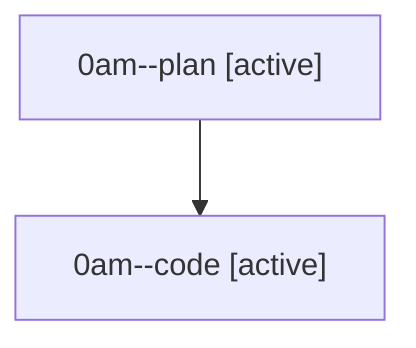

# Family: 0am

[Agent Hoods](../README.md) / [bbugyi200](../users/bbugyi200/README.md) / [athena](../users/bbugyi200/machines/athena/README.md) / [0am](../users/bbugyi200/machines/athena/hoods/0am/README.md) / 0am

Owner: `bbugyi200.athena` · Hood: `0am` · Members: 2

## Lineage

The diagram is an optional enhancement; the ordered table below contains the same lineage in accessible text.

| Role | Agent | State | Model / provider | Timing | Commits | Prompt | Chat |
|---|---|---|---|---|---:|---|---|
| plan | 0am--plan | active | gpt-5.6-sol / codex | 2026-08-22T12:03:59.361009+00:00 | 0 | [Prompt](../agents/bbugyi200.athena.0am--plan/prompt.md) | [Chat](../agents/bbugyi200.athena.0am--plan/chat.md) |
| code | 0am--code | active | grok-4.6 / grok | 2026-08-22T12:21:53.945832+00:00 | [1](../agents/bbugyi200.athena.0am--code/README.md#commits) | — | — |

## Commits

| Role | Repo | Commit | Subject | Committed |
|---|---|---|---|---|
| — | sase | [`19a6e25`](https://github.com/sase-org/sase/commit/19a6e256e6f23172ee2870177587613e62fcd78b) | chore: Add SDD prompt and plan for model\_alias\_at\_prefix | 2026-06-30 08:50:07 EDT |
| — | sase | [`5856cd7`](https://github.com/sase-org/sase/commit/5856cd7a0c6746156c865a1e605556672a68e6e7) | feat!: require @ marker for model aliases | 2026-06-30 09:14:22 EDT |
| code | sase | [`250c012`](https://github.com/sase-org/sase/commit/250c0121d4a552f742b938453717e53d6774ad60) | feat(memory): move final-declaration guidance into generated sase.md | 2026-08-22 09:09:26 EDT |

## Neighbors

| Agent | Relation | State |
|---|---|---|
| [0am.f1](../agents/bbugyi200.athena.0am.f1/README.md) | descendant | completed |
