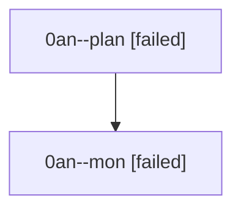

# Family: 0an

[Agent Hoods](../README.md) / [bbugyi200](../users/bbugyi200/README.md) / [athena](../users/bbugyi200/machines/athena/README.md) / [0an](../users/bbugyi200/machines/athena/hoods/0an/README.md) / 0an

Owner: `bbugyi200.athena` · Hood: `0an` · Members: 2

## Lineage

The diagram is an optional enhancement; the ordered table below contains the same lineage in accessible text.

| Role | Agent | State | Model / provider | Timing | Commits | Prompt | Chat |
|---|---|---|---|---|---:|---|---|
| plan | 0an--plan | failed | gpt-5.6-sol / codex | 2026-08-22T12:28:44.117164+00:00 → 2026-08-22T12:46:34.897636+00:00 | 0 | [Prompt](../agents/bbugyi200.athena.0an--plan/prompt.md) | [Chat](../agents/bbugyi200.athena.0an--plan/chat.md) |
| mon | 0an--mon | failed | gpt-5.6-sol / codex | 2026-08-22T12:48:19.492671+00:00 | 0 | — | [Chat](../agents/bbugyi200.athena.0an--mon/chat.md) |

## Commits

| Role | Repo | Commit | Subject | Committed |
|---|---|---|---|---|
| — | sase | [`b9065dc`](https://github.com/sase-org/sase/commit/b9065dcabfbc9a9d11f0064e5f0c4740f1204f4a) | chore: Add SDD prompt and plan for answered\_continuation\_asker\_status | 2026-06-30 12:51:52 UTC |
| — | sase | [`631beaf`](https://github.com/sase-org/sase/commit/631beaf863226145930cd0bd9b6d45f175aa7b58) | fix: mark answered question continuations | 2026-06-30 13:03:05 UTC |
