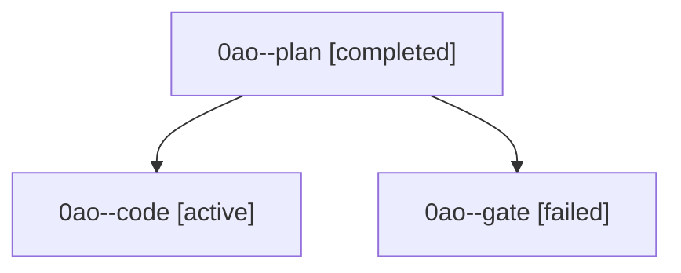

# Family: 0ao

[Agent Hoods](../README.md) / [bbugyi200](../users/bbugyi200/README.md) / [athena](../users/bbugyi200/machines/athena/README.md) / [0ao](../users/bbugyi200/machines/athena/hoods/0ao/README.md) / 0ao

Owner: `bbugyi200.athena` · Hood: `0ao` · Members: 3

## Lineage

The diagram is an optional enhancement; the ordered table below contains the same lineage in accessible text.

| Role | Agent | State | Model / provider | Timing | Commits | Prompt | Chat |
|---|---|---|---|---|---:|---|---|
| plan | 0ao--plan | completed | gpt-6-astra / codex | 2026-09-08T20:16:57.128241+00:00 → 2026-09-08T20:26:31.543747+00:00 | 0 | [Prompt](../agents/bbugyi200.athena.0ao--plan/prompt.md) | [Chat](../agents/bbugyi200.athena.0ao--plan/chat.md) |
| code | 0ao--code | active | sonnet / claude | 2026-09-08T20:28:52.325065+00:00 | [1](../agents/bbugyi200.athena.0ao--code/README.md#commits) | [Prompt](../agents/bbugyi200.athena.0ao--code/prompt.md) | — |
| gate | 0ao--gate | failed | gpt-6-astra / codex | 2026-09-08T20:25:52.387076+00:00 → 2026-09-08T20:28:44.414368+00:00 | 0 | — | [Chat](../agents/bbugyi200.athena.0ao--gate/chat.md) |

## Commits

| Role | Repo | Commit | Subject | Committed |
|---|---|---|---|---|
| — | sase | [`b3c1b7a`](https://github.com/sase-org/sase/commit/b3c1b7ab1ad2b8ee81754114899f405c1a627b59) | chore: Add SDD prompt and plan for agents\_first\_tab\_1 | 2026-06-30 08:56:09 EDT |
| — | sase | [`2404af6`](https://github.com/sase-org/sase/commit/2404af6d2a8d32eb2deb910298b25ee50219faa1) | feat(ace)!: move Agents to the first tab position | 2026-06-30 09:36:30 EDT |
| code | sase | [`dd1f829`](https://github.com/sase-org/sase/commit/dd1f829c2d2289510be190562e2c3ae090abdd62) | feat(artifact-links): require real changes before publishing links | 2026-09-08 17:26:12 EDT |
