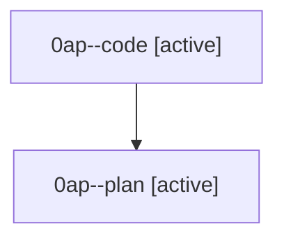

# Family: 0ap

[Agent Hoods](../README.md) / [bbugyi200](../users/bbugyi200/README.md) / [athena](../users/bbugyi200/machines/athena/README.md) / [0ap](../users/bbugyi200/machines/athena/hoods/0ap/README.md) / 0ap

Owner: `bbugyi200.athena` · Hood: `0ap` · Members: 2

## Lineage

The diagram is an optional enhancement; the ordered table below contains the same lineage in accessible text.

| Role | Agent | State | Model / provider | Timing | Commits | Prompt | Chat |
|---|---|---|---|---|---:|---|---|
| code | 0ap--code | active | grok-4.6 / grok | 2026-08-22T12:44:50.860786+00:00 | 0 | — | — |
| plan | 0ap--plan | active | gpt-5.6-sol / codex | 2026-08-22T12:30:11.302909+00:00 | 0 | [Prompt](../agents/bbugyi200.athena.0ap--plan/prompt.md) | [Chat](../agents/bbugyi200.athena.0ap--plan/chat.md) |

## Commits

| Role | Repo | Commit | Subject | Committed |
|---|---|---|---|---|
| — | sase | [`cbb6135`](https://github.com/sase-org/sase/commit/cbb61358a39faaf7a96609d5f09e2bb0e6546be5) | feat: add leader shortcut for SASE updates | 2026-06-30 13:30:00 UTC |
