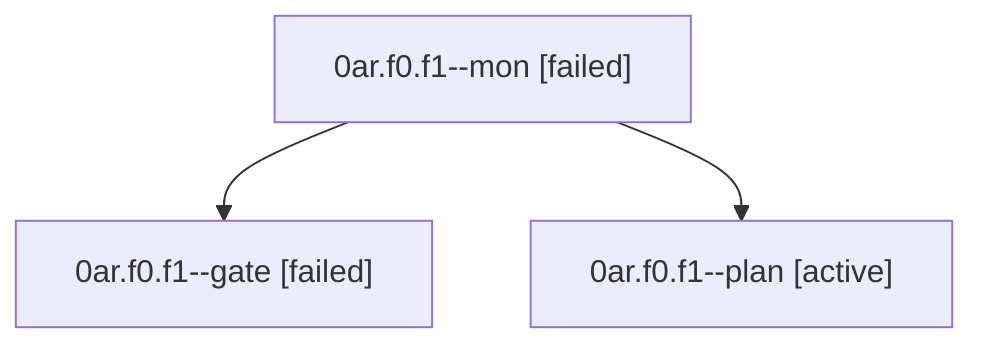

# Family: 0ar.f0.f1

[Agent Hoods](../README.md) / [bbugyi200](../users/bbugyi200/README.md) / [athena](../users/bbugyi200/machines/athena/README.md) / [0ar](../users/bbugyi200/machines/athena/hoods/0ar/README.md) / 0ar.f0.f1

Owner: `bbugyi200.athena` · Hood: `0ar` · Members: 3

## Lineage

The diagram is an optional enhancement; the ordered table below contains the same lineage in accessible text.

| Role | Agent | State | Model / provider | Timing | Commits | Prompt | Chat |
|---|---|---|---|---|---:|---|---|
| mon | 0ar.f0.f1--mon | failed | gpt-5.6-sol / codex | 2026-09-09T12:23:06.163220+00:00 → 2026-09-09T12:25:06.260483+00:00 | 0 | — | [Chat](../agents/bbugyi200.athena.0ar.f0.f1--mon/chat.md) |
| gate | 0ar.f0.f1--gate | failed | gpt-5.6-sol / codex | 2026-09-09T12:09:43.658789+00:00 → 2026-09-09T12:23:08.600738+00:00 | 0 | — | [Chat](../agents/bbugyi200.athena.0ar.f0.f1--gate/chat.md) |
| plan | 0ar.f0.f1--plan | active | gpt-5.6-sol / codex | 2026-09-09T11:59:59.977804+00:00 | 0 | [Prompt](../agents/bbugyi200.athena.0ar.f0.f1--plan/prompt.md) | [Chat](../agents/bbugyi200.athena.0ar.f0.f1--plan/chat.md) |

## Neighbors

| Agent | Relation | State |
|---|---|---|
| [0ar.f0](../agents/bbugyi200.athena.0ar.f0/README.md) | ancestor | active |
| [0ar](../agents/bbugyi200.athena.0ar/README.md) | ancestor | active |
| [0ar.f0.f0](../agents/bbugyi200.athena.0ar.f0.f0/README.md) | 0ar.f0 hood | active |
| [0ar.f1](../agents/bbugyi200.athena.0ar.f1/README.md) | 0ar hood | completed |
