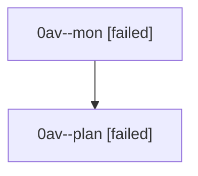

# Family: 0av

[Agent Hoods](../README.md) / [bbugyi200](../users/bbugyi200/README.md) / [athena](../users/bbugyi200/machines/athena/README.md) / [0av](../users/bbugyi200/machines/athena/hoods/0av/README.md) / 0av

Owner: `bbugyi200.athena` · Hood: `0av` · Members: 2

## Lineage

The diagram is an optional enhancement; the ordered table below contains the same lineage in accessible text.

| Role | Agent | State | Model / provider | Timing | Commits | Prompt | Chat |
|---|---|---|---|---|---:|---|---|
| mon | 0av--mon | failed | gpt-5.6-sol / codex | 2026-08-22T13:57:28.241817+00:00 | 0 | — | [Chat](../agents/bbugyi200.athena.0av--mon/chat.md) |
| plan | 0av--plan | failed | gpt-5.6-sol / codex | 2026-08-22T13:41:21.585400+00:00 → 2026-08-22T13:57:08.865887+00:00 | 0 | [Prompt](../agents/bbugyi200.athena.0av--plan/prompt.md) | [Chat](../agents/bbugyi200.athena.0av--plan/chat.md) |

## Commits

| Role | Repo | Commit | Subject | Committed |
|---|---|---|---|---|
| — | sase | [`937278e`](https://github.com/sase-org/sase/commit/937278ecb1b0723a4aa42d55fe60f1cd635e8660) | feat(ace): render bare count in Agents info strip | 2026-07-01 09:56:59 UTC |
