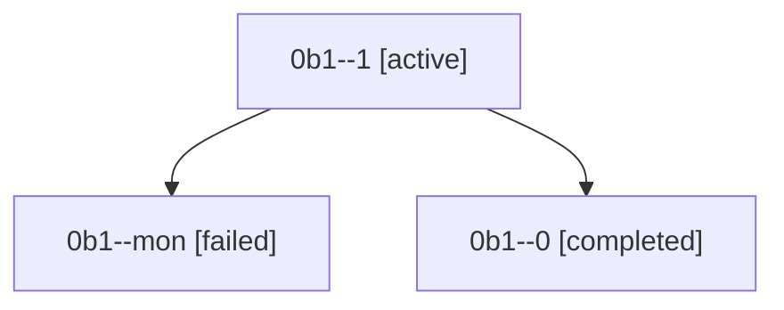

# Family: 0b1

[Agent Hoods](../README.md) / [bbugyi200](../users/bbugyi200/README.md) / [athena](../users/bbugyi200/machines/athena/README.md) / [0b1](../users/bbugyi200/machines/athena/hoods/0b1/README.md) / 0b1

Owner: `bbugyi200.athena` · Hood: `0b1` · Members: 3

## Lineage

The diagram is an optional enhancement; the ordered table below contains the same lineage in accessible text.

| Role | Agent | State | Model / provider | Timing | Commits | Prompt | Chat |
|---|---|---|---|---|---:|---|---|
| 1 | 0b1--1 | active | gpt-5.5 / codex | 2026-08-22T16:27:14.408211+00:00 | [1](../agents/bbugyi200.athena.0b1--1/README.md#commits) | [Prompt](../agents/bbugyi200.athena.0b1--1/prompt.md) | — |
| mon | 0b1--mon | failed | gpt-5.5 / codex | 2026-08-22T16:09:27.008732+00:00 | 0 | — | [Chat](../agents/bbugyi200.athena.0b1--mon/chat.md) |
| 0 | 0b1--0 | completed | gpt-5.5 / codex | 2026-08-22T15:34:52.176880+00:00 → 2026-08-22T16:09:37.580648+00:00 | 0 | [Prompt](../agents/bbugyi200.athena.0b1--0/prompt.md) | [Chat](../agents/bbugyi200.athena.0b1--0/chat.md) |

## Commits

| Role | Repo | Commit | Subject | Committed |
|---|---|---|---|---|
| — | sase | [`32cd557`](https://github.com/sase-org/sase/commit/32cd5575b3a9cd349431c0bbeae6ee1d0fd9bc31) | chore: Add SDD prompt and plan for models\_panel\_coder\_kind\_label | 2026-07-01 07:46:24 EDT |
| — | sase | [`c8b9321`](https://github.com/sase-org/sase/commit/c8b93210fb722bebcba1bacbf363b531f3549ed9) | fix(tui): show provider coder model kind as coder | 2026-07-01 07:56:10 EDT |
| 1 | sase | [`22a2937`](https://github.com/sase-org/sase/commit/22a2937e4a235dab358adb8885f1551114453dad) | fix(bead): relaunch lander after closed epic phases | 2026-08-22 12:51:14 EDT |

## Neighbors

| Agent | Relation | State |
|---|---|---|
| [0b1.f1](../agents/bbugyi200.athena.0b1.f1/README.md) | descendant | completed |
| [0b1.f1.w1](../agents/bbugyi200.athena.0b1.f1.w1/README.md) | descendant | completed |
