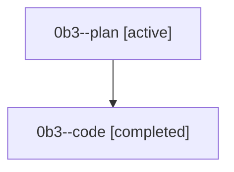

# Family: 0b3

[Agent Hoods](../README.md) / [bbugyi200](../users/bbugyi200/README.md) / [athena](../users/bbugyi200/machines/athena/README.md) / [0b3](../users/bbugyi200/machines/athena/hoods/0b3/README.md) / 0b3

Owner: `bbugyi200.athena` · Hood: `0b3` · Members: 2

## Lineage

The diagram is an optional enhancement; the ordered table below contains the same lineage in accessible text.

| Role | Agent | State | Model / provider | Timing | Commits | Prompt | Chat |
|---|---|---|---|---|---:|---|---|
| plan | 0b3--plan | active | gpt-5.6-sol / codex | 2026-08-22T16:15:25.260151+00:00 | 0 | [Prompt](../agents/bbugyi200.athena.0b3--plan/prompt.md) | [Chat](../agents/bbugyi200.athena.0b3--plan/chat.md) |
| code | 0b3--code | completed | grok-4.6 / grok | 2026-08-22T16:26:00.269859+00:00 → 2026-08-22T17:10:09.598780+00:00 | 0 | — | [Chat](../agents/bbugyi200.athena.0b3--code/chat.md) |

## Commits

| Role | Repo | Commit | Subject | Committed |
|---|---|---|---|---|
| — | sase | [`8ba81d7`](https://github.com/sase-org/sase/commit/8ba81d7ff03166ff0e54df1ac448ea1cb4e6d1b6) | fix(tui): recommend update keymap in update notices | 2026-07-01 08:55:03 EDT |
| — | sase | [`3712033`](https://github.com/sase-org/sase/commit/37120333b0c37a8a1b5c2b5341671cfb70a9d252) | fix(finalizers): preserve mixed reconciliation declarations | 2026-08-22 13:07:29 EDT |
