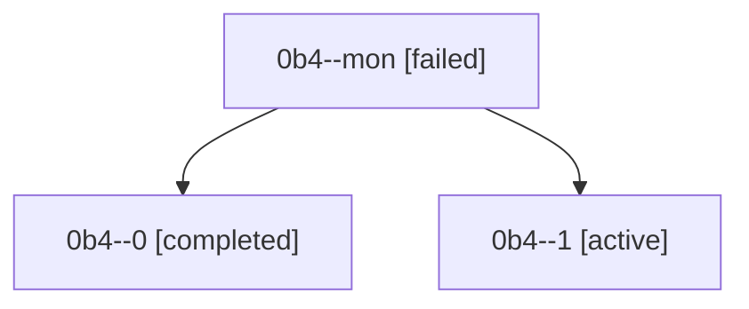

# Family: 0b4

[Agent Hoods](../README.md) / [bbugyi200](../users/bbugyi200/README.md) / [athena](../users/bbugyi200/machines/athena/README.md) / [0b4](../users/bbugyi200/machines/athena/hoods/0b4/README.md) / 0b4

Owner: `bbugyi200.athena` · Hood: `0b4` · Members: 3

## Lineage

The diagram is an optional enhancement; the ordered table below contains the same lineage in accessible text.

| Role | Agent | State | Model / provider | Timing | Commits | Prompt | Chat |
|---|---|---|---|---|---:|---|---|
| mon | 0b4--mon | failed | grok-4.6 / grok | 2026-08-22T16:53:01.963815+00:00 | 0 | — | [Chat](../agents/bbugyi200.athena.0b4--mon/chat.md) |
| 0 | 0b4--0 | completed | grok-4.6 / grok | 2026-08-22T16:16:43.584543+00:00 → 2026-08-22T16:53:13.518972+00:00 | 0 | [Prompt](../agents/bbugyi200.athena.0b4--0/prompt.md) | [Chat](../agents/bbugyi200.athena.0b4--0/chat.md) |
| 1 | 0b4--1 | active | grok-4.6 / grok | 2026-08-22T17:11:49.648086+00:00 | [1](../agents/bbugyi200.athena.0b4--1/README.md#commits) | [Prompt](../agents/bbugyi200.athena.0b4--1/prompt.md) | — |

## Commits

| Role | Repo | Commit | Subject | Committed |
|---|---|---|---|---|
| — | sase | [`0e8cb67`](https://github.com/sase-org/sase/commit/0e8cb67659e70fd237224f50257b210bfe6a5d41) | chore: Add SDD prompt and plan for chezmoi\_apply\_target\_path\_and\_force | 2026-07-01 13:13:58 UTC |
| — | sase | [`09d0c44`](https://github.com/sase-org/sase/commit/09d0c44ddb955a7503e61169efee1b21c6dafd62) | fix(chezmoi): apply target path on config edits and always use --force | 2026-07-01 13:25:22 UTC |
| 1 | sase | [`d61f3bb`](https://github.com/sase-org/sase/commit/d61f3bbc60be5d249ea1474f81bc923bd20afd6d) | feat: raise sase-core-rs floor to 0.31.0 | 2026-08-22 17:25:56 UTC |
