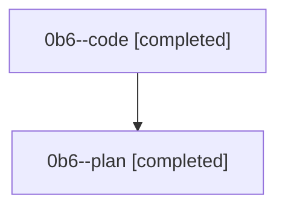

# Family: 0b6

[Agent Hoods](../README.md) / [bbugyi200](../users/bbugyi200/README.md) / [athena](../users/bbugyi200/machines/athena/README.md) / [0b6](../users/bbugyi200/machines/athena/hoods/0b6/README.md) / 0b6

Owner: `bbugyi200.athena` · Hood: `0b6` · Members: 2

## Lineage

The diagram is an optional enhancement; the ordered table below contains the same lineage in accessible text.

| Role | Agent | State | Model / provider | Timing | Commits | Prompt | Chat |
|---|---|---|---|---|---:|---|---|
| code | 0b6--code | completed | gpt-5.5 / codex | 2026-08-22T16:47:08.819753+00:00 → 2026-08-22T18:08:39.643409+00:00 | [1](../agents/bbugyi200.athena.0b6--code/README.md#commits) | — | [Chat](../agents/bbugyi200.athena.0b6--code/chat.md) |
| plan | 0b6--plan | completed | gpt-5.6-sol / codex | 2026-08-22T16:38:48.820541+00:00 → 2026-08-22T18:08:39.643409+00:00 | 0 | [Prompt](../agents/bbugyi200.athena.0b6--plan/prompt.md) | [Chat](../agents/bbugyi200.athena.0b6--plan/chat.md) |

## Commits

| Role | Repo | Commit | Subject | Committed |
|---|---|---|---|---|
| code | sase | [`d8c4085`](https://github.com/sase-org/sase/commit/d8c4085524087b768949f2468c0a57376c56f78c) | fix(finalizers): reject stale final declarations | 2026-08-22 14:06:00 EDT |
