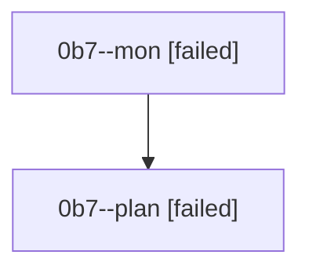

# Family: 0b7

[Agent Hoods](../README.md) / [bbugyi200](../users/bbugyi200/README.md) / [athena](../users/bbugyi200/machines/athena/README.md) / [0b7](../users/bbugyi200/machines/athena/hoods/0b7/README.md) / 0b7

Owner: `bbugyi200.athena` · Hood: `0b7` · Members: 2

## Lineage

The diagram is an optional enhancement; the ordered table below contains the same lineage in accessible text.

| Role | Agent | State | Model / provider | Timing | Commits | Prompt | Chat |
|---|---|---|---|---|---:|---|---|
| mon | 0b7--mon | failed | gpt-5.6-sol / codex | 2026-08-22T17:48:07.098071+00:00 | 0 | — | [Chat](../agents/bbugyi200.athena.0b7--mon/chat.md) |
| plan | 0b7--plan | failed | gpt-5.6-sol / codex | 2026-08-22T17:37:01.311961+00:00 → 2026-08-22T17:47:57.864032+00:00 | 0 | [Prompt](../agents/bbugyi200.athena.0b7--plan/prompt.md) | [Chat](../agents/bbugyi200.athena.0b7--plan/chat.md) |

## Commits

| Role | Repo | Commit | Subject | Committed |
|---|---|---|---|---|
| — | sase | [`821704f`](https://github.com/sase-org/sase/commit/821704fd35563c472efbe84208a6be6a068377da) | chore: Add SDD prompt and plan for fix\_axe\_daemon\_stop\_sigkill\_flake | 2026-07-01 19:57:05 UTC |
| — | sase | [`67a3f94`](https://github.com/sase-org/sase/commit/67a3f943ea2382375fc3dbb8b4b53f39f299e387) | test(axe): deflake daemon-stop SIGKILL escalation race | 2026-07-01 20:02:31 UTC |
