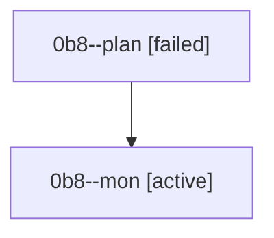

# Family: 0b8

[Agent Hoods](../README.md) / [bbugyi200](../users/bbugyi200/README.md) / [athena](../users/bbugyi200/machines/athena/README.md) / [0b8](../users/bbugyi200/machines/athena/hoods/0b8/README.md) / 0b8

Owner: `bbugyi200.athena` · Hood: `0b8` · Members: 2

## Lineage

The diagram is an optional enhancement; the ordered table below contains the same lineage in accessible text.

| Role | Agent | State | Model / provider | Timing | Commits | Prompt | Chat |
|---|---|---|---|---|---:|---|---|
| plan | 0b8--plan | failed | gpt-5.6-sol / codex | 2026-08-22T17:59:48.114455+00:00 → 2026-08-22T18:14:40.457634+00:00 | 0 | [Prompt](../agents/bbugyi200.athena.0b8--plan/prompt.md) | [Chat](../agents/bbugyi200.athena.0b8--plan/chat.md) |
| mon | 0b8--mon | active | gpt-5.6-sol / codex | 2026-08-22T18:14:52.429135+00:00 | 0 | — | — |
