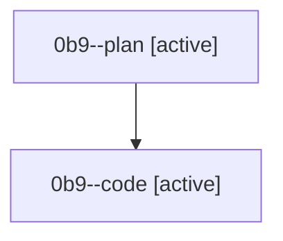

# Family: 0b9

[Agent Hoods](../README.md) / [bbugyi200](../users/bbugyi200/README.md) / [athena](../users/bbugyi200/machines/athena/README.md) / [0b9](../users/bbugyi200/machines/athena/hoods/0b9/README.md) / 0b9

Owner: `bbugyi200.athena` · Hood: `0b9` · Members: 2

## Lineage

The diagram is an optional enhancement; the ordered table below contains the same lineage in accessible text.

| Role | Agent | State | Model / provider | Timing | Commits | Prompt | Chat |
|---|---|---|---|---|---:|---|---|
| plan | 0b9--plan | active | gpt-5.6-sol / codex | 2026-08-22T18:01:15.361067+00:00 | 0 | [Prompt](../agents/bbugyi200.athena.0b9--plan/prompt.md) | [Chat](../agents/bbugyi200.athena.0b9--plan/chat.md) |
| code | 0b9--code | active | grok-4.6 / grok | 2026-08-22T18:12:17.696573+00:00 | 0 | — | — |

## Commits

| Role | Repo | Commit | Subject | Committed |
|---|---|---|---|---|
| — | sase | [`702c8fe`](https://github.com/sase-org/sase/commit/702c8fee83d33d8eecd3440a64e4f3b303c80c18) | docs: recommend plain \`uv tool install sase\` and add INSTALL.md | 2026-07-01 20:40:38 UTC |
