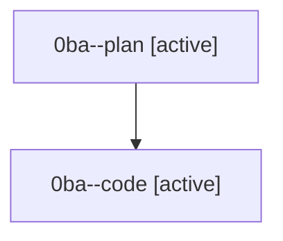

# Family: 0ba

[Agent Hoods](../README.md) / [bbugyi200](../users/bbugyi200/README.md) / [athena](../users/bbugyi200/machines/athena/README.md) / [0ba](../users/bbugyi200/machines/athena/hoods/0ba/README.md) / 0ba

Owner: `bbugyi200.athena` · Hood: `0ba` · Members: 2

## Lineage

The diagram is an optional enhancement; the ordered table below contains the same lineage in accessible text.

| Role | Agent | State | Model / provider | Timing | Commits | Prompt | Chat |
|---|---|---|---|---|---:|---|---|
| plan | 0ba--plan | active | gpt-5.6-sol / codex | 2026-08-22T18:32:05.277665+00:00 | 0 | [Prompt](../agents/bbugyi200.athena.0ba--plan/prompt.md) | [Chat](../agents/bbugyi200.athena.0ba--plan/chat.md) |
| code | 0ba--code | active | grok-4.6 / grok | 2026-08-22T18:41:25.872350+00:00 | 0 | — | — |

## Commits

| Role | Repo | Commit | Subject | Committed |
|---|---|---|---|---|
| — | sase | [`3e86a8a`](https://github.com/sase-org/sase/commit/3e86a8a46cab116822dc64c28b8b6fc4db7c5ad8) | chore: Add SDD prompt and plan for fix\_config\_schema\_wheel\_packaging | 2026-07-02 05:56:10 EDT |
| — | sase | [`3580f1c`](https://github.com/sase-org/sase/commit/3580f1c68810f9409fd7dded341ea312cf39e8bf) | fix: package config schema in wheel | 2026-07-02 06:05:57 EDT |
