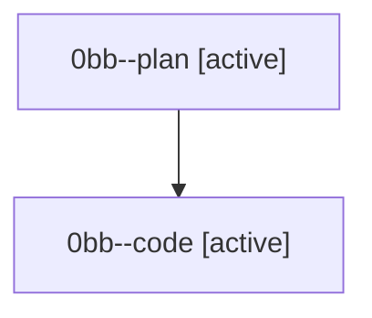

# Family: 0bb

[Agent Hoods](../README.md) / [bbugyi200](../users/bbugyi200/README.md) / [athena](../users/bbugyi200/machines/athena/README.md) / [0bb](../users/bbugyi200/machines/athena/hoods/0bb/README.md) / 0bb

Owner: `bbugyi200.athena` · Hood: `0bb` · Members: 2

## Lineage

The diagram is an optional enhancement; the ordered table below contains the same lineage in accessible text.

| Role | Agent | State | Model / provider | Timing | Commits | Prompt | Chat |
|---|---|---|---|---|---:|---|---|
| plan | 0bb--plan | active | gpt-5.6-sol / codex | 2026-08-22T18:34:50.832835+00:00 | 0 | [Prompt](../agents/bbugyi200.athena.0bb--plan/prompt.md) | [Chat](../agents/bbugyi200.athena.0bb--plan/chat.md) |
| code | 0bb--code | active | gpt-5.5 / codex | 2026-08-22T18:41:44.056603+00:00 | 0 | — | — |

## Commits

| Role | Repo | Commit | Subject | Committed |
|---|---|---|---|---|
| — | sase | [`ccc2636`](https://github.com/sase-org/sase/commit/ccc263641630dc57c084575893cf0432f58052e7) | chore: Add SDD prompt and plan for agents\_starting\_total | 2026-07-02 09:54:07 UTC |
| — | sase | [`97f34fa`](https://github.com/sase-org/sase/commit/97f34fa983c53adfe1e5ddee4753c7bf3d234ae9) | fix(ace): include STARTING agents in Agents tab headline total | 2026-07-02 10:03:21 UTC |
