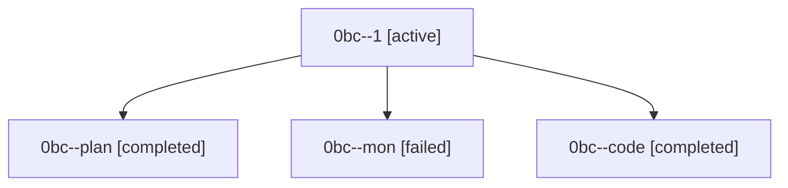

# Family: 0bc

[Agent Hoods](../README.md) / [bbugyi200](../users/bbugyi200/README.md) / [athena](../users/bbugyi200/machines/athena/README.md) / [0bc](../users/bbugyi200/machines/athena/hoods/0bc/README.md) / 0bc

Owner: `bbugyi200.athena` · Hood: `0bc` · Members: 4

## Lineage

The diagram is an optional enhancement; the ordered table below contains the same lineage in accessible text.

| Role | Agent | State | Model / provider | Timing | Commits | Prompt | Chat |
|---|---|---|---|---|---:|---|---|
| 1 | 0bc--1 | active | grok-4.6 / grok | 2026-08-22T20:22:52.408802+00:00 | 0 | [Prompt](../agents/bbugyi200.athena.0bc--1/prompt.md) | — |
| plan | 0bc--plan | completed | gpt-5.6-sol / codex | 2026-08-22T19:34:39.526381+00:00 → 2026-08-22T20:05:31.311523+00:00 | 0 | [Prompt](../agents/bbugyi200.athena.0bc--plan/prompt.md) | [Chat](../agents/bbugyi200.athena.0bc--plan/chat.md) |
| mon | 0bc--mon | failed | grok-4.6 / grok | 2026-08-22T20:05:24.464598+00:00 | 0 | — | [Chat](../agents/bbugyi200.athena.0bc--mon/chat.md) |
| code | 0bc--code | completed | grok-4.6 / grok | 2026-08-22T19:40:50.369279+00:00 → 2026-08-22T20:05:31.311523+00:00 | 0 | — | [Chat](../agents/bbugyi200.athena.0bc--code/chat.md) |
