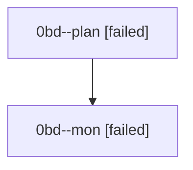

# Family: 0bd

[Agent Hoods](../README.md) / [bbugyi200](../users/bbugyi200/README.md) / [athena](../users/bbugyi200/machines/athena/README.md) / [0bd](../users/bbugyi200/machines/athena/hoods/0bd/README.md) / 0bd

Owner: `bbugyi200.athena` · Hood: `0bd` · Members: 2

## Lineage

The diagram is an optional enhancement; the ordered table below contains the same lineage in accessible text.

| Role | Agent | State | Model / provider | Timing | Commits | Prompt | Chat |
|---|---|---|---|---|---:|---|---|
| plan | 0bd--plan | failed | opus / claude | 2026-08-23T11:15:47.289202+00:00 → 2026-08-23T11:39:22.775145+00:00 | 0 | [Prompt](../agents/bbugyi200.athena.0bd--plan/prompt.md) | [Chat](../agents/bbugyi200.athena.0bd--plan/chat.md) |
| mon | 0bd--mon | failed | opus / claude | 2026-08-23T11:39:33.766313+00:00 | 0 | — | [Chat](../agents/bbugyi200.athena.0bd--mon/chat.md) |

## Commits

| Role | Repo | Commit | Subject | Committed |
|---|---|---|---|---|
| — | sase | [`53efb1f`](https://github.com/sase-org/sase/commit/53efb1f3e97c68ce34c6e6d15753a096490ed8fc) | chore: Add SDD prompt and plan for auto\_archive\_closed\_prs | 2026-07-02 07:17:13 EDT |
| — | sase | [`df54ba5`](https://github.com/sase-org/sase/commit/df54ba51bcc7400bea1d75c41ddf05032115daba) | fix: archive closed submitted checks | 2026-07-02 07:26:26 EDT |
