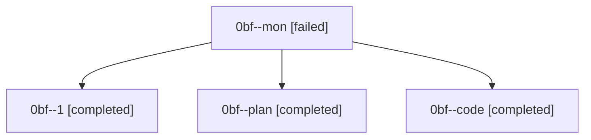

# Family: 0bf

[Agent Hoods](../README.md) / [bbugyi200](../users/bbugyi200/README.md) / [athena](../users/bbugyi200/machines/athena/README.md) / [0bf](../users/bbugyi200/machines/athena/hoods/0bf/README.md) / 0bf

Owner: `bbugyi200.athena` · Hood: `0bf` · Members: 4

## Lineage

The diagram is an optional enhancement; the ordered table below contains the same lineage in accessible text.

| Role | Agent | State | Model / provider | Timing | Commits | Prompt | Chat |
|---|---|---|---|---|---:|---|---|
| mon | 0bf--mon | failed | sonnet / claude | 2026-08-23T12:17:33.978571+00:00 | 0 | — | [Chat](../agents/bbugyi200.athena.0bf--mon/chat.md) |
| 1 | 0bf--1 | completed | sonnet / claude | 2026-08-23T12:26:03.163117+00:00 → 2026-08-23T12:38:12.318319+00:00 | [1](../agents/bbugyi200.athena.0bf--1/README.md#commits) | [Prompt](../agents/bbugyi200.athena.0bf--1/prompt.md) | [Chat](../agents/bbugyi200.athena.0bf--1/chat.md) |
| plan | 0bf--plan | completed | opus / claude | 2026-08-23T11:39:05.368325+00:00 → 2026-08-23T12:17:50.555692+00:00 | 0 | [Prompt](../agents/bbugyi200.athena.0bf--plan/prompt.md) | [Chat](../agents/bbugyi200.athena.0bf--plan/chat.md) |
| code | 0bf--code | completed | sonnet / claude | 2026-08-23T11:51:24.055223+00:00 → 2026-08-23T12:17:50.555692+00:00 | 0 | — | [Chat](../agents/bbugyi200.athena.0bf--code/chat.md) |

## Commits

| Role | Repo | Commit | Subject | Committed |
|---|---|---|---|---|
| 1 | sase | [`1dd58f0`](https://github.com/sase-org/sase/commit/1dd58f06cd52585d90dcafcbb3d92af670e754a7) | fix(time): resolve UTC-hardcoded display sites and add config.timezone doctor check | 2026-08-23 08:30:21 EDT |
