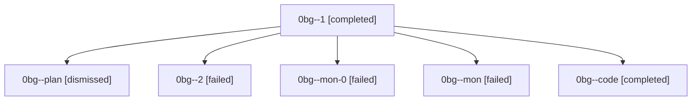

# Family: 0bg

[Agent Hoods](../README.md) / [bbugyi200](../users/bbugyi200/README.md) / [athena](../users/bbugyi200/machines/athena/README.md) / [0bg](../users/bbugyi200/machines/athena/hoods/0bg/README.md) / 0bg

Owner: `bbugyi200.athena` · Hood: `0bg` · Members: 6

## Lineage

The diagram is an optional enhancement; the ordered table below contains the same lineage in accessible text.

| Role | Agent | State | Model / provider | Timing | Commits | Prompt | Chat |
|---|---|---|---|---|---:|---|---|
| 1 | 0bg--1 | completed | grok-4.6 / grok | 2026-08-23T11:49:55.014094+00:00 → 2026-08-23T11:53:51.090801+00:00 | 0 | [Prompt](../agents/bbugyi200.athena.0bg--1/prompt.md) | [Chat](../agents/bbugyi200.athena.0bg--1/chat.md) |
| plan | 0bg--plan | dismissed | — | 2026-08-23T11:41:13 | 0 | — | — |
| 2 | 0bg--2 | failed | grok-4.6 / grok | 2026-08-23T11:56:12.842772+00:00 → 2026-08-23T11:58:59.682294+00:00 | 0 | [Prompt](../agents/bbugyi200.athena.0bg--2/prompt.md) | — |
| mon-0 | 0bg--mon-0 | failed | grok-4.6 / grok | 2026-08-23T11:53:44.770992+00:00 | 0 | — | [Chat](../agents/bbugyi200.athena.0bg--mon-0/chat.md) |
| mon | 0bg--mon | failed | grok-4.6 / grok | 2026-08-23T11:48:50.029342+00:00 | 0 | — | [Chat](../agents/bbugyi200.athena.0bg--mon/chat.md) |
| code | 0bg--code | completed | grok-4.6 / grok | 2026-08-23T11:44:50.571710+00:00 → 2026-08-23T11:48:56.570468+00:00 | 0 | — | [Chat](../agents/bbugyi200.athena.0bg--code/chat.md) |

## Commits

| Role | Repo | Commit | Subject | Committed |
|---|---|---|---|---|
| — | sase | [`67929ab`](https://github.com/sase-org/sase/commit/67929abea95837d22b15b0a9d317100a70039a01) | docs(research): add blog launch readiness audit for xprompts, agents tab, and install flow | 2026-07-02 15:24:02 EDT |

## Neighbors

| Agent | Relation | State |
|---|---|---|
| [0bg.f1](../agents/bbugyi200.athena.0bg.f1/README.md) | descendant | completed |
