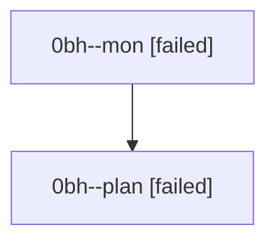

# Family: 0bh

[Agent Hoods](../README.md) / [bbugyi200](../users/bbugyi200/README.md) / [athena](../users/bbugyi200/machines/athena/README.md) / [0bh](../users/bbugyi200/machines/athena/hoods/0bh/README.md) / 0bh

Owner: `bbugyi200.athena` · Hood: `0bh` · Members: 2

## Lineage

The diagram is an optional enhancement; the ordered table below contains the same lineage in accessible text.

| Role | Agent | State | Model / provider | Timing | Commits | Prompt | Chat |
|---|---|---|---|---|---:|---|---|
| mon | 0bh--mon | failed | opus / claude | 2026-08-23T12:01:29.139783+00:00 | 0 | — | [Chat](../agents/bbugyi200.athena.0bh--mon/chat.md) |
| plan | 0bh--plan | failed | opus / claude | 2026-08-23T11:43:31.996012+00:00 → 2026-08-23T12:01:16.539985+00:00 | 0 | [Prompt](../agents/bbugyi200.athena.0bh--plan/prompt.md) | [Chat](../agents/bbugyi200.athena.0bh--plan/chat.md) |

## Commits

| Role | Repo | Commit | Subject | Committed |
|---|---|---|---|---|
| — | sase | [`2d8a8b9`](https://github.com/sase-org/sase/commit/2d8a8b9b9a181bbf54d325f35c283ace90fc3125) | chore: Add SDD prompt and plan for xprompt\_silent\_failure\_diagnostics | 2026-07-02 15:57:26 EDT |
| — | sase | [`d698779`](https://github.com/sase-org/sase/commit/d698779c60c01082a75f2a642dd9f23cd986994f) | feat(xprompt): diagnose unresolved xprompt references | 2026-07-02 16:14:02 EDT |
