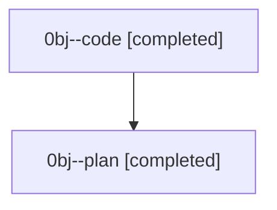

# Family: 0bj

[Agent Hoods](../README.md) / [bbugyi200](../users/bbugyi200/README.md) / [athena](../users/bbugyi200/machines/athena/README.md) / [0bj](../users/bbugyi200/machines/athena/hoods/0bj/README.md) / 0bj

Owner: `bbugyi200.athena` · Hood: `0bj` · Members: 2

## Lineage

The diagram is an optional enhancement; the ordered table below contains the same lineage in accessible text.

| Role | Agent | State | Model / provider | Timing | Commits | Prompt | Chat |
|---|---|---|---|---|---:|---|---|
| code | 0bj--code | completed | grok-4.6 / grok | 2026-08-23T12:01:05.633433+00:00 → 2026-08-23T12:43:44.108275+00:00 | [1](../agents/bbugyi200.athena.0bj--code/README.md#commits) | — | [Chat](../agents/bbugyi200.athena.0bj--code/chat.md) |
| plan | 0bj--plan | completed | opus / claude | 2026-08-23T11:49:33.776740+00:00 → 2026-08-23T12:43:44.108275+00:00 | 0 | [Prompt](../agents/bbugyi200.athena.0bj--plan/prompt.md) | [Chat](../agents/bbugyi200.athena.0bj--plan/chat.md) |

## Commits

| Role | Repo | Commit | Subject | Committed |
|---|---|---|---|---|
| code | sase | [`e2056bd`](https://github.com/sase-org/sase/commit/e2056bddebf0898dbf67f8aa8420a057dab42712) | docs(axe): warn that content-only once\_per keys stay reserved | 2026-08-23 08:43:05 EDT |
