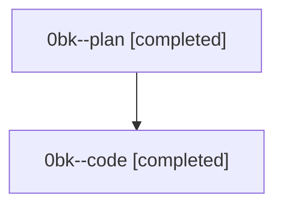

# Family: 0bk

[Agent Hoods](../README.md) / [bbugyi200](../users/bbugyi200/README.md) / [athena](../users/bbugyi200/machines/athena/README.md) / [0bk](../users/bbugyi200/machines/athena/hoods/0bk/README.md) / 0bk

Owner: `bbugyi200.athena` · Hood: `0bk` · Members: 2

## Lineage

The diagram is an optional enhancement; the ordered table below contains the same lineage in accessible text.

| Role | Agent | State | Model / provider | Timing | Commits | Prompt | Chat |
|---|---|---|---|---|---:|---|---|
| plan | 0bk--plan | completed | gpt-5.6-sol / codex | 2026-08-23T11:49:56.576504+00:00 → 2026-08-23T12:42:37.726671+00:00 | 0 | [Prompt](../agents/bbugyi200.athena.0bk--plan/prompt.md) | [Chat](../agents/bbugyi200.athena.0bk--plan/chat.md) |
| code | 0bk--code | completed | grok-4.6 / grok | 2026-08-23T12:01:45.688587+00:00 → 2026-08-23T12:42:37.726671+00:00 | [1](../agents/bbugyi200.athena.0bk--code/README.md#commits) | — | [Chat](../agents/bbugyi200.athena.0bk--code/chat.md) |

## Commits

| Role | Repo | Commit | Subject | Committed |
|---|---|---|---|---|
| code | sase | [`9422a5f`](https://github.com/sase-org/sase/commit/9422a5f37df8dcfc8092e25fee05602db19059f9) | feat(tui): color Agents tree guides by hierarchy depth | 2026-08-23 08:39:58 EDT |
