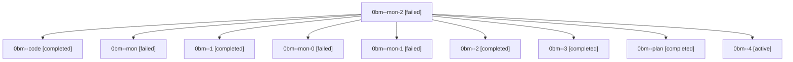

# Family: 0bm

[Agent Hoods](../README.md) / [bbugyi200](../users/bbugyi200/README.md) / [athena](../users/bbugyi200/machines/athena/README.md) / [0bm](../users/bbugyi200/machines/athena/hoods/0bm/README.md) / 0bm

Owner: `bbugyi200.athena` · Hood: `0bm` · Members: 10

## Lineage

The diagram is an optional enhancement; the ordered table below contains the same lineage in accessible text.

| Role | Agent | State | Model / provider | Timing | Commits | Prompt | Chat |
|---|---|---|---|---|---:|---|---|
| mon-2 | 0bm--mon-2 | failed | grok-4.6 / grok | 2026-08-23T15:24:39.521076+00:00 | 0 | — | [Chat](../agents/bbugyi200.athena.0bm--mon-2/chat.md) |
| code | 0bm--code | completed | grok-4.6 / grok | 2026-08-23T12:15:40.365350+00:00 → 2026-08-23T13:30:52.543903+00:00 | 0 | — | [Chat](../agents/bbugyi200.athena.0bm--code/chat.md) |
| mon | 0bm--mon | failed | grok-4.6 / grok | 2026-08-23T13:29:47.161841+00:00 | 0 | — | [Chat](../agents/bbugyi200.athena.0bm--mon/chat.md) |
| 1 | 0bm--1 | completed | grok-4.6 / grok | 2026-08-23T13:57:50.851973+00:00 → 2026-08-23T14:28:51.968316+00:00 | 0 | [Prompt](../agents/bbugyi200.athena.0bm--1/prompt.md) | [Chat](../agents/bbugyi200.athena.0bm--1/chat.md) |
| mon-0 | 0bm--mon-0 | failed | grok-4.6 / grok | 2026-08-23T14:28:12.142230+00:00 | 0 | — | [Chat](../agents/bbugyi200.athena.0bm--mon-0/chat.md) |
| mon-1 | 0bm--mon-1 | failed | grok-4.6 / grok | 2026-08-23T14:57:44.172542+00:00 | 0 | — | [Chat](../agents/bbugyi200.athena.0bm--mon-1/chat.md) |
| 2 | 0bm--2 | completed | grok-4.6 / grok | 2026-08-23T14:50:29.709477+00:00 → 2026-08-23T14:57:58.586341+00:00 | 0 | [Prompt](../agents/bbugyi200.athena.0bm--2/prompt.md) | [Chat](../agents/bbugyi200.athena.0bm--2/chat.md) |
| 3 | 0bm--3 | completed | grok-4.6 / grok | 2026-08-23T15:18:30.276451+00:00 → 2026-08-23T15:24:53.784650+00:00 | 0 | [Prompt](../agents/bbugyi200.athena.0bm--3/prompt.md) | [Chat](../agents/bbugyi200.athena.0bm--3/chat.md) |
| plan | 0bm--plan | completed | gpt-5.6-sol / codex | 2026-08-23T12:00:53.607271+00:00 → 2026-08-23T13:30:52.543903+00:00 | 0 | [Prompt](../agents/bbugyi200.athena.0bm--plan/prompt.md) | [Chat](../agents/bbugyi200.athena.0bm--plan/chat.md) |
| 4 | 0bm--4 | active | grok-4.6 / grok | 2026-08-23T15:30:25.583078+00:00 | 0 | [Prompt](../agents/bbugyi200.athena.0bm--4/prompt.md) | — |
