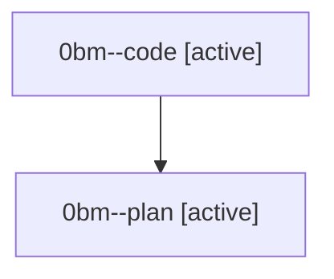

# Family: 0bm

[Agent Hoods](../README.md) / [bbugyi200](../users/bbugyi200/README.md) / [athena](../users/bbugyi200/machines/athena/README.md) / [0bm](../users/bbugyi200/machines/athena/hoods/0bm/README.md) / 0bm

Owner: `bbugyi200.athena` · Hood: `0bm` · Members: 2

## Lineage

The diagram is an optional enhancement; the ordered table below contains the same lineage in accessible text.

| Role | Agent | State | Model / provider | Timing | Commits | Prompt | Chat |
|---|---|---|---|---|---:|---|---|
| code | 0bm--code | active | grok-4.6 / grok | 2026-08-23T12:15:40.365350+00:00 | 0 | — | — |
| plan | 0bm--plan | active | gpt-5.6-sol / codex | 2026-08-23T12:00:53.607271+00:00 | 0 | [Prompt](../agents/bbugyi200.athena.0bm--plan/prompt.md) | [Chat](../agents/bbugyi200.athena.0bm--plan/chat.md) |
