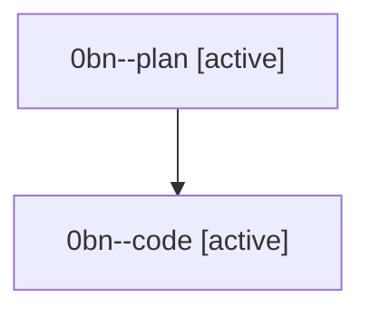

# Family: 0bn

[Agent Hoods](../README.md) / [bbugyi200](../users/bbugyi200/README.md) / [athena](../users/bbugyi200/machines/athena/README.md) / [0bn](../users/bbugyi200/machines/athena/hoods/0bn/README.md) / 0bn

Owner: `bbugyi200.athena` · Hood: `0bn` · Members: 2

## Lineage

The diagram is an optional enhancement; the ordered table below contains the same lineage in accessible text.

| Role | Agent | State | Model / provider | Timing | Commits | Prompt | Chat |
|---|---|---|---|---|---:|---|---|
| plan | 0bn--plan | active | opus / claude | 2026-08-23T12:03:00.477314+00:00 | 0 | [Prompt](../agents/bbugyi200.athena.0bn--plan/prompt.md) | [Chat](../agents/bbugyi200.athena.0bn--plan/chat.md) |
| code | 0bn--code | active | grok-4.6 / grok | 2026-08-23T12:32:48.761833+00:00 | [1](../agents/bbugyi200.athena.0bn--code/README.md#commits) | — | — |

## Commits

| Role | Repo | Commit | Subject | Committed |
|---|---|---|---|---|
| code | sase | [`0ccfd7a`](https://github.com/sase-org/sase/commit/0ccfd7a6ff3c52b163c8a05c1fa3065e1588db97) | fix(ace): order family monitor phases after the shell that started them | 2026-08-23 09:06:31 EDT |
