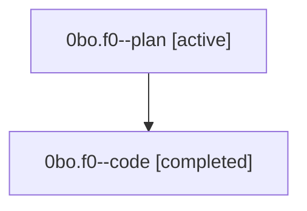

# Family: 0bo.f0

[Agent Hoods](../README.md) / [bbugyi200](../users/bbugyi200/README.md) / [athena](../users/bbugyi200/machines/athena/README.md) / [0bo](../users/bbugyi200/machines/athena/hoods/0bo/README.md) / 0bo.f0

Owner: `bbugyi200.athena` · Hood: `0bo` · Members: 2

## Lineage

The diagram is an optional enhancement; the ordered table below contains the same lineage in accessible text.

| Role | Agent | State | Model / provider | Timing | Commits | Prompt | Chat |
|---|---|---|---|---|---:|---|---|
| plan | 0bo.f0--plan | active | opus / claude | 2026-08-23T14:10:24.928685+00:00 | 0 | [Prompt](../agents/bbugyi200.athena.0bo.f0--plan/prompt.md) | [Chat](../agents/bbugyi200.athena.0bo.f0--plan/chat.md) |
| code | 0bo.f0--code | completed | grok-4.6 / grok | 2026-08-23T14:21:43.579631+00:00 → 2026-08-23T14:49:33.611255+00:00 | [1](../agents/bbugyi200.athena.0bo.f0--code/README.md#commits) | — | [Chat](../agents/bbugyi200.athena.0bo.f0--code/chat.md) |

## Commits

| Role | Repo | Commit | Subject | Committed |
|---|---|---|---|---|
| code | sase | [`8d8d84e`](https://github.com/sase-org/sase/commit/8d8d84e3d8ae04d093bfa90e710d0b1f79d7f5e5) | fix(ace): join family runtime suffix with a bare slash | 2026-08-23 10:48:38 EDT |

## Neighbors

| Agent | Relation | State |
|---|---|---|
| [0bo](bbugyi200.athena.0bo.md) (family · 2) | ancestor | active 1, completed 1 |
