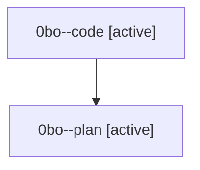

# Family: 0bo

[Agent Hoods](../README.md) / [bbugyi200](../users/bbugyi200/README.md) / [athena](../users/bbugyi200/machines/athena/README.md) / [0bo](../users/bbugyi200/machines/athena/hoods/0bo/README.md) / 0bo

Owner: `bbugyi200.athena` · Hood: `0bo` · Members: 2

## Lineage

The diagram is an optional enhancement; the ordered table below contains the same lineage in accessible text.

| Role | Agent | State | Model / provider | Timing | Commits | Prompt | Chat |
|---|---|---|---|---|---:|---|---|
| code | 0bo--code | active | gpt-5.5 / codex | 2026-08-23T12:59:11.427809+00:00 | [1](../agents/bbugyi200.athena.0bo--code/README.md#commits) | — | — |
| plan | 0bo--plan | active | gpt-5.6-sol / codex | 2026-08-23T12:51:15.578477+00:00 | 0 | [Prompt](../agents/bbugyi200.athena.0bo--plan/prompt.md) | [Chat](../agents/bbugyi200.athena.0bo--plan/chat.md) |

## Commits

| Role | Repo | Commit | Subject | Committed |
|---|---|---|---|---|
| code | sase | [`184fa9a`](https://github.com/sase-org/sase/commit/184fa9aed8b71a950393c8d1eba67bcee6141766) | feat(ace): show current family shell runtime | 2026-08-23 10:01:53 EDT |
