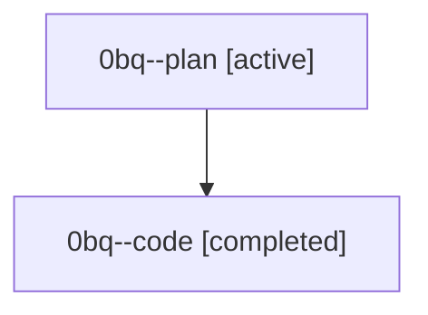

# Family: 0bq

[Agent Hoods](../README.md) / [bbugyi200](../users/bbugyi200/README.md) / [athena](../users/bbugyi200/machines/athena/README.md) / [0bq](../users/bbugyi200/machines/athena/hoods/0bq/README.md) / 0bq

Owner: `bbugyi200.athena` · Hood: `0bq` · Members: 2

## Lineage

The diagram is an optional enhancement; the ordered table below contains the same lineage in accessible text.

| Role | Agent | State | Model / provider | Timing | Commits | Prompt | Chat |
|---|---|---|---|---|---:|---|---|
| plan | 0bq--plan | active | opus / claude | 2026-08-23T13:40:22.660538+00:00 | 0 | [Prompt](../agents/bbugyi200.athena.0bq--plan/prompt.md) | [Chat](../agents/bbugyi200.athena.0bq--plan/chat.md) |
| code | 0bq--code | completed | grok-4.6 / grok | 2026-08-23T13:55:07.284139+00:00 → 2026-08-23T14:58:21.941515+00:00 | [1](../agents/bbugyi200.athena.0bq--code/README.md#commits) | — | [Chat](../agents/bbugyi200.athena.0bq--code/chat.md) |

## Commits

| Role | Repo | Commit | Subject | Committed |
|---|---|---|---|---|
| code | sase | [`6536745`](https://github.com/sase-org/sase/commit/65367452b95634556873d1d44ac4373d9bc7a9e3) | fix(finalizers): give declaration recovery an evidence brief of its own run | 2026-08-23 10:57:47 EDT |
