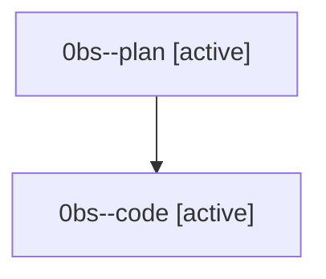

# Family: 0bs

[Agent Hoods](../README.md) / [bbugyi200](../users/bbugyi200/README.md) / [athena](../users/bbugyi200/machines/athena/README.md) / [0bs](../users/bbugyi200/machines/athena/hoods/0bs/README.md) / 0bs

Owner: `bbugyi200.athena` · Hood: `0bs` · Members: 2

## Lineage

The diagram is an optional enhancement; the ordered table below contains the same lineage in accessible text.

| Role | Agent | State | Model / provider | Timing | Commits | Prompt | Chat |
|---|---|---|---|---|---:|---|---|
| plan | 0bs--plan | active | opus / claude | 2026-08-23T14:26:14.989375+00:00 | 0 | [Prompt](../agents/bbugyi200.athena.0bs--plan/prompt.md) | [Chat](../agents/bbugyi200.athena.0bs--plan/chat.md) |
| code | 0bs--code | active | grok-4.6 / grok | 2026-08-23T14:34:26.955011+00:00 | [1](../agents/bbugyi200.athena.0bs--code/README.md#commits) | — | — |

## Commits

| Role | Repo | Commit | Subject | Committed |
|---|---|---|---|---|
| code | sase | [`7690b23`](https://github.com/sase-org/sase/commit/7690b23f863bc188992a3202d76e364f5decedc1) | feat(memory): generate task\_types.md for project roots only | 2026-08-23 11:27:59 EDT |
