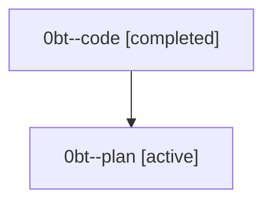

# Family: 0bt

[Agent Hoods](../README.md) / [bbugyi200](../users/bbugyi200/README.md) / [athena](../users/bbugyi200/machines/athena/README.md) / [0bt](../users/bbugyi200/machines/athena/hoods/0bt/README.md) / 0bt

Owner: `bbugyi200.athena` · Hood: `0bt` · Members: 2

## Lineage

The diagram is an optional enhancement; the ordered table below contains the same lineage in accessible text.

| Role | Agent | State | Model / provider | Timing | Commits | Prompt | Chat |
|---|---|---|---|---|---:|---|---|
| code | 0bt--code | completed | grok-4.6 / grok | 2026-08-23T14:41:46.147986+00:00 → 2026-08-23T15:33:28.726324+00:00 | 0 | — | [Chat](../agents/bbugyi200.athena.0bt--code/chat.md) |
| plan | 0bt--plan | active | gpt-5.6-sol / codex | 2026-08-23T14:34:21.844288+00:00 | 0 | [Prompt](../agents/bbugyi200.athena.0bt--plan/prompt.md) | [Chat](../agents/bbugyi200.athena.0bt--plan/chat.md) |

## Commits

| Role | Repo | Commit | Subject | Committed |
|---|---|---|---|---|
| — | sase | [`b4a8688`](https://github.com/sase-org/sase/commit/b4a86889383e932ff5761dbfdb6ec26752b2b631) | feat(cli)!: drop the sase commit alias; stitch create is the only tracked VCS path | 2026-08-23 11:31:20 EDT |
