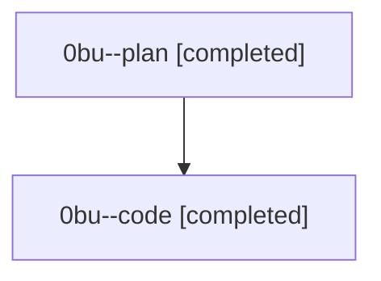

# Family: 0bu

[Agent Hoods](../README.md) / [bbugyi200](../users/bbugyi200/README.md) / [athena](../users/bbugyi200/machines/athena/README.md) / [0bu](../users/bbugyi200/machines/athena/hoods/0bu/README.md) / 0bu

Owner: `bbugyi200.athena` · Hood: `0bu` · Members: 2

## Lineage

The diagram is an optional enhancement; the ordered table below contains the same lineage in accessible text.

| Role | Agent | State | Model / provider | Timing | Commits | Prompt | Chat |
|---|---|---|---|---|---:|---|---|
| plan | 0bu--plan | completed | gpt-5.6-sol / codex | 2026-08-23T14:47:13.786863+00:00 → 2026-08-23T15:20:44.812863+00:00 | 0 | [Prompt](../agents/bbugyi200.athena.0bu--plan/prompt.md) | [Chat](../agents/bbugyi200.athena.0bu--plan/chat.md) |
| code | 0bu--code | completed | gpt-5.5 / codex | 2026-08-23T14:56:16.593678+00:00 → 2026-08-23T15:20:44.812863+00:00 | [1](../agents/bbugyi200.athena.0bu--code/README.md#commits) | — | [Chat](../agents/bbugyi200.athena.0bu--code/chat.md) |

## Commits

| Role | Repo | Commit | Subject | Committed |
|---|---|---|---|---|
| code | sase | [`f0982f2`](https://github.com/sase-org/sase/commit/f0982f28b82bd135db92fc0fd48d8d2aca6ad161) | fix(commit): auto-close assigned beads after landing | 2026-08-23 11:17:43 EDT |
