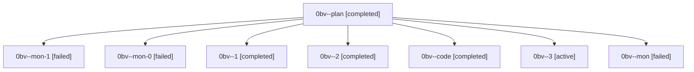

# Family: 0bv

[Agent Hoods](../README.md) / [bbugyi200](../users/bbugyi200/README.md) / [athena](../users/bbugyi200/machines/athena/README.md) / [0bv](../users/bbugyi200/machines/athena/hoods/0bv/README.md) / 0bv

Owner: `bbugyi200.athena` · Hood: `0bv` · Members: 8

## Lineage

The diagram is an optional enhancement; the ordered table below contains the same lineage in accessible text.

| Role | Agent | State | Model / provider | Timing | Commits | Prompt | Chat |
|---|---|---|---|---|---:|---|---|
| plan | 0bv--plan | completed | opus / claude | 2026-08-23T14:52:50.935263+00:00 → 2026-08-23T15:48:05.639943+00:00 | 0 | [Prompt](../agents/bbugyi200.athena.0bv--plan/prompt.md) | [Chat](../agents/bbugyi200.athena.0bv--plan/chat.md) |
| mon-1 | 0bv--mon-1 | failed | sonnet / claude | 2026-08-23T16:32:30.715078+00:00 | 0 | — | [Chat](../agents/bbugyi200.athena.0bv--mon-1/chat.md) |
| mon-0 | 0bv--mon-0 | failed | sonnet / claude | 2026-08-23T16:07:39.008359+00:00 | 0 | — | [Chat](../agents/bbugyi200.athena.0bv--mon-0/chat.md) |
| 1 | 0bv--1 | completed | sonnet / claude | 2026-08-23T16:02:30.965184+00:00 → 2026-08-23T16:07:48.181158+00:00 | 0 | [Prompt](../agents/bbugyi200.athena.0bv--1/prompt.md) | [Chat](../agents/bbugyi200.athena.0bv--1/chat.md) |
| 2 | 0bv--2 | completed | sonnet / claude | 2026-08-23T16:23:25.751459+00:00 → 2026-08-23T16:32:44.322811+00:00 | 0 | [Prompt](../agents/bbugyi200.athena.0bv--2/prompt.md) | [Chat](../agents/bbugyi200.athena.0bv--2/chat.md) |
| code | 0bv--code | completed | sonnet / claude | 2026-08-23T15:06:44.056780+00:00 → 2026-08-23T15:48:05.639943+00:00 | 0 | — | [Chat](../agents/bbugyi200.athena.0bv--code/chat.md) |
| 3 | 0bv--3 | active | sonnet / claude | 2026-08-23T16:33:12.254542+00:00 | [1](../agents/bbugyi200.athena.0bv--3/README.md#commits) | [Prompt](../agents/bbugyi200.athena.0bv--3/prompt.md) | — |
| mon | 0bv--mon | failed | sonnet / claude | 2026-08-23T15:47:55.408699+00:00 | 0 | — | [Chat](../agents/bbugyi200.athena.0bv--mon/chat.md) |

## Commits

| Role | Repo | Commit | Subject | Committed |
|---|---|---|---|---|
| 3 | sase | [`22ece6b`](https://github.com/sase-org/sase/commit/22ece6b7c1bcc19301b01339e643d88ca647d3cb) | feat(test-cost): commit per-cause cpu\_limit budgets with provenance | 2026-08-23 12:34:31 EDT |
