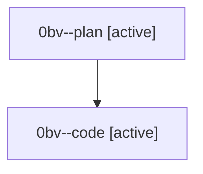

# Family: 0bv

[Agent Hoods](../README.md) / [bbugyi200](../users/bbugyi200/README.md) / [athena](../users/bbugyi200/machines/athena/README.md) / [0bv](../users/bbugyi200/machines/athena/hoods/0bv/README.md) / 0bv

Owner: `bbugyi200.athena` · Hood: `0bv` · Members: 2

## Lineage

The diagram is an optional enhancement; the ordered table below contains the same lineage in accessible text.

| Role | Agent | State | Model / provider | Timing | Commits | Prompt | Chat |
|---|---|---|---|---|---:|---|---|
| plan | 0bv--plan | active | opus / claude | 2026-08-23T14:52:50.935263+00:00 | 0 | [Prompt](../agents/bbugyi200.athena.0bv--plan/prompt.md) | [Chat](../agents/bbugyi200.athena.0bv--plan/chat.md) |
| code | 0bv--code | active | sonnet / claude | 2026-08-23T15:06:44.056780+00:00 | 0 | — | — |
