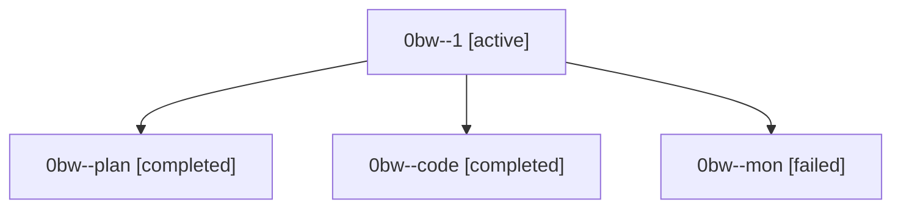

# Family: 0bw

[Agent Hoods](../README.md) / [bbugyi200](../users/bbugyi200/README.md) / [athena](../users/bbugyi200/machines/athena/README.md) / [0bw](../users/bbugyi200/machines/athena/hoods/0bw/README.md) / 0bw

Owner: `bbugyi200.athena` · Hood: `0bw` · Members: 4

## Lineage

The diagram is an optional enhancement; the ordered table below contains the same lineage in accessible text.

| Role | Agent | State | Model / provider | Timing | Commits | Prompt | Chat |
|---|---|---|---|---|---:|---|---|
| 1 | 0bw--1 | active | gpt-5.5 / codex | 2026-08-23T18:31:30.043856+00:00 | [1](../agents/bbugyi200.athena.0bw--1/README.md#commits) | [Prompt](../agents/bbugyi200.athena.0bw--1/prompt.md) | — |
| plan | 0bw--plan | completed | gpt-5.6-sol / codex | 2026-08-23T17:24:52.836538+00:00 → 2026-08-23T18:14:43.580827+00:00 | 0 | [Prompt](../agents/bbugyi200.athena.0bw--plan/prompt.md) | [Chat](../agents/bbugyi200.athena.0bw--plan/chat.md) |
| code | 0bw--code | completed | gpt-5.5 / codex | 2026-08-23T17:33:03.476240+00:00 → 2026-08-23T18:14:43.580827+00:00 | 0 | — | [Chat](../agents/bbugyi200.athena.0bw--code/chat.md) |
| mon | 0bw--mon | failed | gpt-5.5 / codex | 2026-08-23T18:14:26.544539+00:00 | 0 | — | [Chat](../agents/bbugyi200.athena.0bw--mon/chat.md) |

## Commits

| Role | Repo | Commit | Subject | Committed |
|---|---|---|---|---|
| 1 | sase | [`4612a84`](https://github.com/sase-org/sase/commit/4612a84c896e912c021788cc212d2e843e20242c) | feat(vcs): add stitch type filtering | 2026-08-23 14:53:31 EDT |
