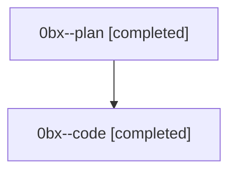

# Family: 0bx

[Agent Hoods](../README.md) / [bbugyi200](../users/bbugyi200/README.md) / [athena](../users/bbugyi200/machines/athena/README.md) / [0bx](../users/bbugyi200/machines/athena/hoods/0bx/README.md) / 0bx

Owner: `bbugyi200.athena` · Hood: `0bx` · Members: 2

## Lineage

The diagram is an optional enhancement; the ordered table below contains the same lineage in accessible text.

| Role | Agent | State | Model / provider | Timing | Commits | Prompt | Chat |
|---|---|---|---|---|---:|---|---|
| plan | 0bx--plan | completed | opus / claude | 2026-08-23T17:34:30.329392+00:00 → 2026-08-23T18:16:08.178824+00:00 | 0 | [Prompt](../agents/bbugyi200.athena.0bx--plan/prompt.md) | [Chat](../agents/bbugyi200.athena.0bx--plan/chat.md) |
| code | 0bx--code | completed | gpt-5.5 / codex | 2026-08-23T18:00:20.814293+00:00 → 2026-08-23T18:16:08.178824+00:00 | [1](../agents/bbugyi200.athena.0bx--code/README.md#commits) | — | [Chat](../agents/bbugyi200.athena.0bx--code/chat.md) |

## Commits

| Role | Repo | Commit | Subject | Committed |
|---|---|---|---|---|
| code | sase | [`6eb51ac`](https://github.com/sase-org/sase/commit/6eb51ac49cc08f23ec240f9b73ed059788395a5c) | fix(ace): preserve proc shell selection on refresh | 2026-08-23 14:15:35 EDT |
