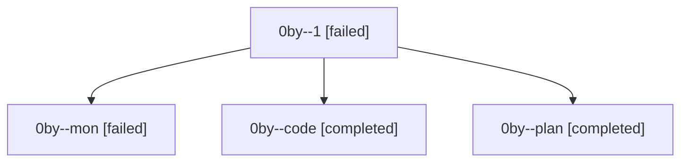

# Family: 0by

[Agent Hoods](../README.md) / [bbugyi200](../users/bbugyi200/README.md) / [athena](../users/bbugyi200/machines/athena/README.md) / [0by](../users/bbugyi200/machines/athena/hoods/0by/README.md) / 0by

Owner: `bbugyi200.athena` · Hood: `0by` · Members: 4

## Lineage

The diagram is an optional enhancement; the ordered table below contains the same lineage in accessible text.

| Role | Agent | State | Model / provider | Timing | Commits | Prompt | Chat |
|---|---|---|---|---|---:|---|---|
| 1 | 0by--1 | failed | gpt-5.5 / codex | 2026-08-23T19:47:21.631570+00:00 → 2026-08-23T20:06:17.364295+00:00 | 0 | [Prompt](../agents/bbugyi200.athena.0by--1/prompt.md) | — |
| mon | 0by--mon | failed | gpt-5.5 / codex | 2026-08-23T19:27:53.565665+00:00 | 0 | — | [Chat](../agents/bbugyi200.athena.0by--mon/chat.md) |
| code | 0by--code | completed | gpt-5.5 / codex | 2026-08-23T18:44:27.443154+00:00 → 2026-08-23T19:28:06.862121+00:00 | 0 | — | [Chat](../agents/bbugyi200.athena.0by--code/chat.md) |
| plan | 0by--plan | completed | opus / claude | 2026-08-23T18:27:11.381805+00:00 → 2026-08-23T19:28:06.862121+00:00 | 0 | [Prompt](../agents/bbugyi200.athena.0by--plan/prompt.md) | [Chat](../agents/bbugyi200.athena.0by--plan/chat.md) |
