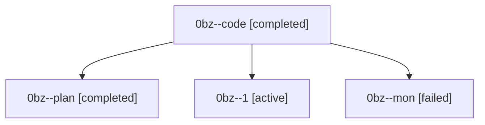

# Family: 0bz

[Agent Hoods](../README.md) / [bbugyi200](../users/bbugyi200/README.md) / [athena](../users/bbugyi200/machines/athena/README.md) / [0bz](../users/bbugyi200/machines/athena/hoods/0bz/README.md) / 0bz

Owner: `bbugyi200.athena` · Hood: `0bz` · Members: 4

## Lineage

The diagram is an optional enhancement; the ordered table below contains the same lineage in accessible text.

| Role | Agent | State | Model / provider | Timing | Commits | Prompt | Chat |
|---|---|---|---|---|---:|---|---|
| code | 0bz--code | completed | grok-4.6 / grok | 2026-08-23T19:15:26.162835+00:00 → 2026-08-23T19:58:21.943363+00:00 | 0 | — | [Chat](../agents/bbugyi200.athena.0bz--code/chat.md) |
| plan | 0bz--plan | completed | gpt-5.6-sol / codex | 2026-08-23T19:00:27.979651+00:00 → 2026-08-23T19:58:21.943363+00:00 | 0 | [Prompt](../agents/bbugyi200.athena.0bz--plan/prompt.md) | [Chat](../agents/bbugyi200.athena.0bz--plan/chat.md) |
| 1 | 0bz--1 | active | grok-4.6 / grok | 2026-08-23T20:16:27.629056+00:00 | 0 | [Prompt](../agents/bbugyi200.athena.0bz--1/prompt.md) | — |
| mon | 0bz--mon | failed | grok-4.6 / grok | 2026-08-23T19:58:13.328173+00:00 | 0 | — | [Chat](../agents/bbugyi200.athena.0bz--mon/chat.md) |
