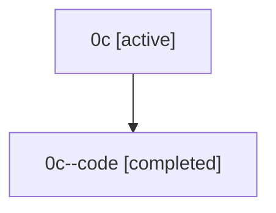

# Family: 0c

Owner: `bbugyi200.athena` · Hood: `0c` · Members: 2

## Lineage

The diagram is an optional enhancement; the ordered table below contains the same lineage in accessible text.

| Role | Agent | State | Model / provider | Timing | Commits | Prompt | Chat |
|---|---|---|---|---|---:|---|---|
| root | 0c | active | opus / claude | 2026-07-07T04:43:49.333855+00:00 | 4 | [Prompt](../agents/bbugyi200.athena.0c/prompt.md) | [Chat](../agents/bbugyi200.athena.0c/chat.md) |
| code | 0c--code | completed | gpt-5.5 / codex | 2026-07-07T05:07:12.246861+00:00 | 0 | — | [Chat](../agents/bbugyi200.athena.0c--code/chat.md) |
