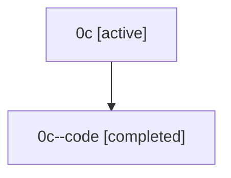

# Family: 0c

[Agent Hoods](../README.md) / [bbugyi200](../users/bbugyi200/README.md) / [athena](../users/bbugyi200/machines/athena/README.md) / [0c](../users/bbugyi200/machines/athena/hoods/0c/README.md) / 0c

Owner: `bbugyi200.athena` · Hood: `0c` · Members: 2

## Lineage

The diagram is an optional enhancement; the ordered table below contains the same lineage in accessible text.

| Role | Agent | State | Model / provider | Timing | Commits | Prompt | Chat |
|---|---|---|---|---|---:|---|---|
| root | 0c | active | opus / claude | 2026-07-07T04:43:49.333855+00:00 | [1](../agents/bbugyi200.athena.0c/README.md#commits) | [Prompt](../agents/bbugyi200.athena.0c/prompt.md) | [Chat](../agents/bbugyi200.athena.0c/chat.md) |
| code | 0c--code | completed | gpt-5.5 / codex | 2026-07-07T05:07:12.246861+00:00 | [1](../agents/bbugyi200.athena.0c--code/README.md#commits) | — | [Chat](../agents/bbugyi200.athena.0c--code/chat.md) |

## Commits

| Role | Repo | Commit | Subject | Committed |
|---|---|---|---|---|
| — | sase | [`b1bf540`](https://github.com/sase-org/sase/commit/b1bf540dc6995d03042d5a0af5106de4ee99e752) | chore: Add SDD prompt and plan for config\_edit\_modal\_fullscreen | 2026-07-05 23:24:25 UTC |
| — | sase | [`f56f137`](https://github.com/sase-org/sase/commit/f56f137fc88b637959f98cc54f944e8677d8408d) | feat(tui): expand config edit modal for multiline content | 2026-07-05 23:59:00 UTC |
| root | sase | [`90777bd`](https://github.com/sase-org/sase/commit/90777bd4963aae5213b814c51345681a82769619) | chore: Add SDD prompt and plan for launch\_preview\_pdf | 2026-07-07 05:07:11 UTC |
| code | sase | [`8aa58d6`](https://github.com/sase-org/sase/commit/8aa58d6d5fa65f9e43056b787483e451388b084e) | feat: render launch previews as highlighted PDFs | 2026-07-07 05:21:08 UTC |
