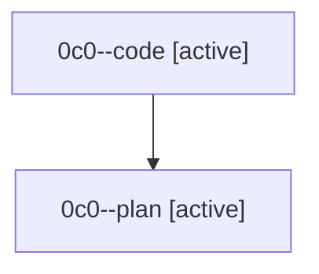

# Family: 0c0

[Agent Hoods](../README.md) / [bbugyi200](../users/bbugyi200/README.md) / [athena](../users/bbugyi200/machines/athena/README.md) / [0c0](../users/bbugyi200/machines/athena/hoods/0c0/README.md) / 0c0

Owner: `bbugyi200.athena` · Hood: `0c0` · Members: 2

## Lineage

The diagram is an optional enhancement; the ordered table below contains the same lineage in accessible text.

| Role | Agent | State | Model / provider | Timing | Commits | Prompt | Chat |
|---|---|---|---|---|---:|---|---|
| code | 0c0--code | active | grok-4.6 / grok | 2026-08-23T19:56:20.489823+00:00 | [1](../agents/bbugyi200.athena.0c0--code/README.md#commits) | — | — |
| plan | 0c0--plan | active | opus / claude | 2026-08-23T19:32:10.684691+00:00 | 0 | [Prompt](../agents/bbugyi200.athena.0c0--plan/prompt.md) | [Chat](../agents/bbugyi200.athena.0c0--plan/chat.md) |

## Commits

| Role | Repo | Commit | Subject | Committed |
|---|---|---|---|---|
| code | sase | [`20f0d13`](https://github.com/sase-org/sase/commit/20f0d13959116e67db52269d10f4be0591da6011) | fix(tui): stop settled monitor starters from borrowing monitor runtime | 2026-08-23 16:17:06 EDT |
