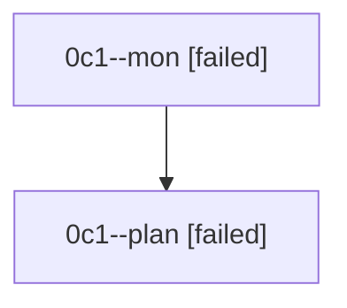

# Family: 0c1

[Agent Hoods](../README.md) / [bbugyi200](../users/bbugyi200/README.md) / [athena](../users/bbugyi200/machines/athena/README.md) / [0c1](../users/bbugyi200/machines/athena/hoods/0c1/README.md) / 0c1

Owner: `bbugyi200.athena` · Hood: `0c1` · Members: 2

## Lineage

The diagram is an optional enhancement; the ordered table below contains the same lineage in accessible text.

| Role | Agent | State | Model / provider | Timing | Commits | Prompt | Chat |
|---|---|---|---|---|---:|---|---|
| mon | 0c1--mon | failed | gpt-5.6-sol / codex | 2026-08-23T20:21:01.959235+00:00 | 0 | — | [Chat](../agents/bbugyi200.athena.0c1--mon/chat.md) |
| plan | 0c1--plan | failed | gpt-5.6-sol / codex | 2026-08-23T20:06:31.851827+00:00 → 2026-08-23T20:20:55.213737+00:00 | 0 | [Prompt](../agents/bbugyi200.athena.0c1--plan/prompt.md) | [Chat](../agents/bbugyi200.athena.0c1--plan/chat.md) |
