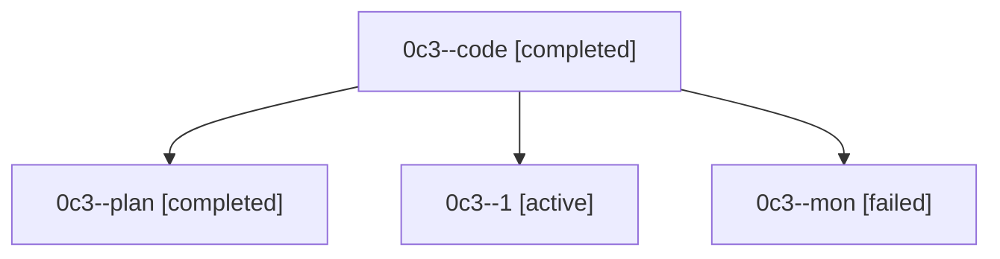

# Family: 0c3

[Agent Hoods](../README.md) / [bbugyi200](../users/bbugyi200/README.md) / [athena](../users/bbugyi200/machines/athena/README.md) / [0c3](../users/bbugyi200/machines/athena/hoods/0c3/README.md) / 0c3

Owner: `bbugyi200.athena` · Hood: `0c3` · Members: 4

## Lineage

The diagram is an optional enhancement; the ordered table below contains the same lineage in accessible text.

| Role | Agent | State | Model / provider | Timing | Commits | Prompt | Chat |
|---|---|---|---|---|---:|---|---|
| code | 0c3--code | completed | gpt-5.5 / codex | 2026-08-24T01:50:51.781702+00:00 → 2026-08-24T04:25:52.364563+00:00 | 0 | — | [Chat](../agents/bbugyi200.athena.0c3--code/chat.md) |
| plan | 0c3--plan | completed | opus / claude | 2026-08-24T01:09:46.763903+00:00 → 2026-08-24T04:25:52.364563+00:00 | 0 | [Prompt](../agents/bbugyi200.athena.0c3--plan/prompt.md) | [Chat](../agents/bbugyi200.athena.0c3--plan/chat.md) |
| 1 | 0c3--1 | active | gpt-5.5 / codex | 2026-08-24T04:41:50.045022+00:00 | [1](../agents/bbugyi200.athena.0c3--1/README.md#commits) | [Prompt](../agents/bbugyi200.athena.0c3--1/prompt.md) | — |
| mon | 0c3--mon | failed | gpt-5.5 / codex | 2026-08-24T04:23:16.947603+00:00 | 0 | — | [Chat](../agents/bbugyi200.athena.0c3--mon/chat.md) |

## Commits

| Role | Repo | Commit | Subject | Committed |
|---|---|---|---|---|
| 1 | sase | [`1f21c4b`](https://github.com/sase-org/sase/commit/1f21c4b846657cbf601be4d7fec7ec47053a52ba) | test: restore green CI for v0.17.0 | 2026-08-24 01:03:10 EDT |
