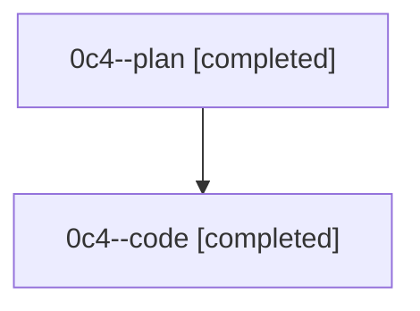

# Family: 0c4

[Agent Hoods](../README.md) / [bbugyi200](../users/bbugyi200/README.md) / [athena](../users/bbugyi200/machines/athena/README.md) / [0c4](../users/bbugyi200/machines/athena/hoods/0c4/README.md) / 0c4

Owner: `bbugyi200.athena` · Hood: `0c4` · Members: 2

## Lineage

The diagram is an optional enhancement; the ordered table below contains the same lineage in accessible text.

| Role | Agent | State | Model / provider | Timing | Commits | Prompt | Chat |
|---|---|---|---|---|---:|---|---|
| plan | 0c4--plan | completed | gpt-5.6-sol / codex | 2026-08-24T01:13:34.657068+00:00 → 2026-08-24T01:53:17.819563+00:00 | 0 | [Prompt](../agents/bbugyi200.athena.0c4--plan/prompt.md) | [Chat](../agents/bbugyi200.athena.0c4--plan/chat.md) |
| code | 0c4--code | completed | gpt-5.5 / codex | 2026-08-24T01:31:20.093044+00:00 → 2026-08-24T01:53:17.819563+00:00 | [1](../agents/bbugyi200.athena.0c4--code/README.md#commits) | — | [Chat](../agents/bbugyi200.athena.0c4--code/chat.md) |

## Commits

| Role | Repo | Commit | Subject | Committed |
|---|---|---|---|---|
| code | sase | [`7f05bed`](https://github.com/sase-org/sase/commit/7f05bed4fa9a2187a1ea8e86b0054ca2576d2b19) | test(finalizer): split declaration channel tests | 2026-08-23 21:52:47 EDT |
