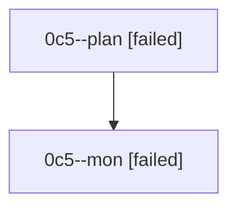

# Family: 0c5

[Agent Hoods](../README.md) / [bbugyi200](../users/bbugyi200/README.md) / [athena](../users/bbugyi200/machines/athena/README.md) / [0c5](../users/bbugyi200/machines/athena/hoods/0c5/README.md) / 0c5

Owner: `bbugyi200.athena` · Hood: `0c5` · Members: 2

## Lineage

The diagram is an optional enhancement; the ordered table below contains the same lineage in accessible text.

| Role | Agent | State | Model / provider | Timing | Commits | Prompt | Chat |
|---|---|---|---|---|---:|---|---|
| plan | 0c5--plan | failed | opus / claude | 2026-08-24T09:47:03.019965+00:00 → 2026-08-24T10:11:30.036039+00:00 | 0 | [Prompt](../agents/bbugyi200.athena.0c5--plan/prompt.md) | [Chat](../agents/bbugyi200.athena.0c5--plan/chat.md) |
| mon | 0c5--mon | failed | opus / claude | 2026-08-24T10:11:40.193847+00:00 | 0 | — | [Chat](../agents/bbugyi200.athena.0c5--mon/chat.md) |
