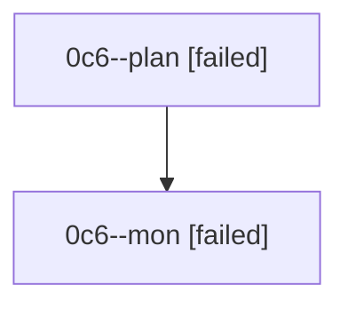

# Family: 0c6

[Agent Hoods](../README.md) / [bbugyi200](../users/bbugyi200/README.md) / [athena](../users/bbugyi200/machines/athena/README.md) / [0c6](../users/bbugyi200/machines/athena/hoods/0c6/README.md) / 0c6

Owner: `bbugyi200.athena` · Hood: `0c6` · Members: 2

## Lineage

The diagram is an optional enhancement; the ordered table below contains the same lineage in accessible text.

| Role | Agent | State | Model / provider | Timing | Commits | Prompt | Chat |
|---|---|---|---|---|---:|---|---|
| plan | 0c6--plan | failed | gpt-5.6-sol / codex | 2026-08-24T10:47:04.770594+00:00 → 2026-08-24T11:02:12.786615+00:00 | 0 | [Prompt](../agents/bbugyi200.athena.0c6--plan/prompt.md) | [Chat](../agents/bbugyi200.athena.0c6--plan/chat.md) |
| mon | 0c6--mon | failed | gpt-5.6-sol / codex | 2026-08-24T11:02:22.220372+00:00 | 0 | — | [Chat](../agents/bbugyi200.athena.0c6--mon/chat.md) |
