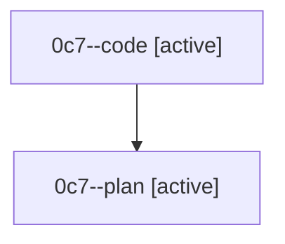

# Family: 0c7

[Agent Hoods](../README.md) / [bbugyi200](../users/bbugyi200/README.md) / [athena](../users/bbugyi200/machines/athena/README.md) / [0c7](../users/bbugyi200/machines/athena/hoods/0c7/README.md) / 0c7

Owner: `bbugyi200.athena` · Hood: `0c7` · Members: 2

## Lineage

The diagram is an optional enhancement; the ordered table below contains the same lineage in accessible text.

| Role | Agent | State | Model / provider | Timing | Commits | Prompt | Chat |
|---|---|---|---|---|---:|---|---|
| code | 0c7--code | active | grok-4.6 / grok | 2026-08-24T11:02:46.464935+00:00 | 0 | — | — |
| plan | 0c7--plan | active | opus / claude | 2026-08-24T10:48:14.074894+00:00 | 0 | [Prompt](../agents/bbugyi200.athena.0c7--plan/prompt.md) | [Chat](../agents/bbugyi200.athena.0c7--plan/chat.md) |
