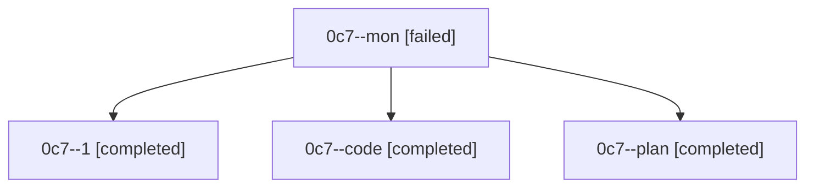

# Family: 0c7

[Agent Hoods](../README.md) / [bbugyi200](../users/bbugyi200/README.md) / [athena](../users/bbugyi200/machines/athena/README.md) / [0c7](../users/bbugyi200/machines/athena/hoods/0c7/README.md) / 0c7

Owner: `bbugyi200.athena` · Hood: `0c7` · Members: 4

## Lineage

The diagram is an optional enhancement; the ordered table below contains the same lineage in accessible text.

| Role | Agent | State | Model / provider | Timing | Commits | Prompt | Chat |
|---|---|---|---|---|---:|---|---|
| mon | 0c7--mon | failed | grok-4.6 / grok | 2026-08-24T12:00:57.428938+00:00 | 0 | — | [Chat](../agents/bbugyi200.athena.0c7--mon/chat.md) |
| 1 | 0c7--1 | completed | grok-4.6 / grok | 2026-08-24T12:18:38.457122+00:00 → 2026-08-24T12:49:38.825267+00:00 | [1](../agents/bbugyi200.athena.0c7--1/README.md#commits) | [Prompt](../agents/bbugyi200.athena.0c7--1/prompt.md) | [Chat](../agents/bbugyi200.athena.0c7--1/chat.md) |
| code | 0c7--code | completed | grok-4.6 / grok | 2026-08-24T11:02:46.464935+00:00 → 2026-08-24T12:01:11.063527+00:00 | 0 | — | [Chat](../agents/bbugyi200.athena.0c7--code/chat.md) |
| plan | 0c7--plan | completed | opus / claude | 2026-08-24T10:48:14.074894+00:00 → 2026-08-24T12:01:11.063527+00:00 | 0 | [Prompt](../agents/bbugyi200.athena.0c7--plan/prompt.md) | [Chat](../agents/bbugyi200.athena.0c7--plan/chat.md) |

## Commits

| Role | Repo | Commit | Subject | Committed |
|---|---|---|---|---|
| 1 | sase | [`f7595ad`](https://github.com/sase-org/sase/commit/f7595ad53e21cd26cf630718ce5a5767dac3a5f1) | feat(ace): dismiss finished proc-shell rows from the Agents tab | 2026-08-24 08:48:49 EDT |
