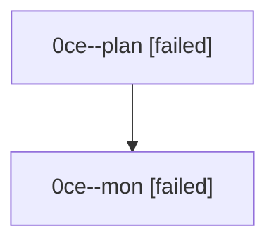

# Family: 0ce

[Agent Hoods](../README.md) / [bbugyi200](../users/bbugyi200/README.md) / [athena](../users/bbugyi200/machines/athena/README.md) / [0ce](../users/bbugyi200/machines/athena/hoods/0ce/README.md) / 0ce

Owner: `bbugyi200.athena` · Hood: `0ce` · Members: 2

## Lineage

The diagram is an optional enhancement; the ordered table below contains the same lineage in accessible text.

| Role | Agent | State | Model / provider | Timing | Commits | Prompt | Chat |
|---|---|---|---|---|---:|---|---|
| plan | 0ce--plan | failed | opus / claude | 2026-08-24T14:15:30.259217+00:00 → 2026-08-24T14:28:56.469771+00:00 | 0 | [Prompt](../agents/bbugyi200.athena.0ce--plan/prompt.md) | [Chat](../agents/bbugyi200.athena.0ce--plan/chat.md) |
| mon | 0ce--mon | failed | opus / claude | 2026-08-24T14:29:07.865021+00:00 | 0 | — | [Chat](../agents/bbugyi200.athena.0ce--mon/chat.md) |
