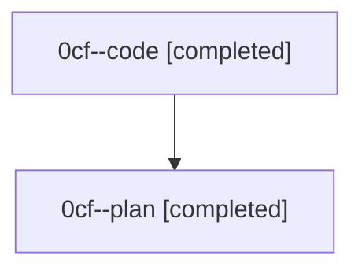

# Family: 0cf

[Agent Hoods](../README.md) / [bbugyi200](../users/bbugyi200/README.md) / [athena](../users/bbugyi200/machines/athena/README.md) / [0cf](../users/bbugyi200/machines/athena/hoods/0cf/README.md) / 0cf

Owner: `bbugyi200.athena` · Hood: `0cf` · Members: 2

## Lineage

The diagram is an optional enhancement; the ordered table below contains the same lineage in accessible text.

| Role | Agent | State | Model / provider | Timing | Commits | Prompt | Chat |
|---|---|---|---|---|---:|---|---|
| code | 0cf--code | completed | sonnet / claude | 2026-08-24T14:42:37.395426+00:00 → 2026-08-24T15:39:33.022355+00:00 | [1](../agents/bbugyi200.athena.0cf--code/README.md#commits) | — | [Chat](../agents/bbugyi200.athena.0cf--code/chat.md) |
| plan | 0cf--plan | completed | gpt-5.6-sol / codex | 2026-08-24T14:31:34.285383+00:00 → 2026-08-24T15:39:33.022355+00:00 | 0 | [Prompt](../agents/bbugyi200.athena.0cf--plan/prompt.md) | [Chat](../agents/bbugyi200.athena.0cf--plan/chat.md) |

## Commits

| Role | Repo | Commit | Subject | Committed |
|---|---|---|---|---|
| code | sase | [`1b23813`](https://github.com/sase-org/sase/commit/1b238136654b2d2cf5b41c2299ab010b17324083) | fix(ace): make family-root kill-and-edit name reuse deterministic | 2026-08-24 11:36:06 EDT |
