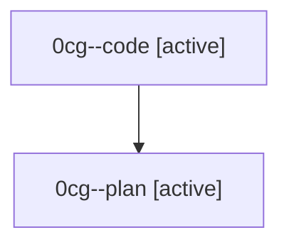

# Family: 0cg

[Agent Hoods](../README.md) / [bbugyi200](../users/bbugyi200/README.md) / [athena](../users/bbugyi200/machines/athena/README.md) / [0cg](../users/bbugyi200/machines/athena/hoods/0cg/README.md) / 0cg

Owner: `bbugyi200.athena` · Hood: `0cg` · Members: 2

## Lineage

The diagram is an optional enhancement; the ordered table below contains the same lineage in accessible text.

| Role | Agent | State | Model / provider | Timing | Commits | Prompt | Chat |
|---|---|---|---|---|---:|---|---|
| code | 0cg--code | active | gpt-5.5 / codex | 2026-08-24T15:11:37.501433+00:00 | [1](../agents/bbugyi200.athena.0cg--code/README.md#commits) | — | — |
| plan | 0cg--plan | active | gpt-5.6-sol / codex | 2026-08-24T15:07:47.405153+00:00 | 0 | [Prompt](../agents/bbugyi200.athena.0cg--plan/prompt.md) | [Chat](../agents/bbugyi200.athena.0cg--plan/chat.md) |

## Commits

| Role | Repo | Commit | Subject | Committed |
|---|---|---|---|---|
| code | sase | [`7d956d0`](https://github.com/sase-org/sase/commit/7d956d03be392df7ef7d088b5ceb8a8801eeaa0c) | fix(symvision): repair finalizer setup syntax | 2026-08-24 11:28:19 EDT |
